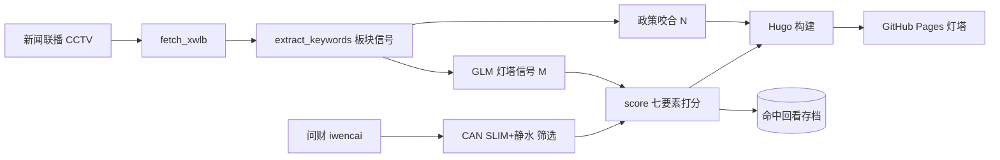

# 🗼 灯塔 Lighthouse

> **A 股投资辅助终端** · 宏观大势研判 × CAN SLIM 全市场选股 · 每日自动更新
>
> 🔗 线上:<https://ming-h.github.io/lighthouse/>

每晚用《新闻联播》+ 宏观信号研判大盘方向(进攻 / 观望 / 防守),每个交易日用 **CAN SLIM + 静水超级成长股**方法给全 A 股打分筛出领涨候选,历史回看验证选股有效性——把"该不该买、买什么、为什么"收进一个终端。

> ⚠️ 本项目是选股**框架与信号工具**,**非投资建议,不荐股、不给买卖点承诺**。A 股有风险,据此交易盈亏自负。

---

## ✨ 核心功能

| 模块 | 内容 | 参考 |
|---|---|---|
| **大盘视野** | GLM 基于新闻联播研判「灯塔信号」三色 = CAN SLIM 的 M | IBD *The Big Picture* |
| **每日选股** | 全市场 CAN SLIM 七要素打分 → TOP20 + 全市场排行 | IBD 50 / Daily Stock Lists |
| **政策咬合** | 新闻联播板块信号 → 代表股催化标记(N 要素) | CAN SLIM 的 N |
| **命中回看** | 每日存档候选,跟踪相对沪深 300 超额,验证方法有效性 | *独创* |
| 个股体检 | 输入代码 → 七要素深度体检(开发中) | MarketSmith / Stock Checkup |

---

## 🧠 方法论:CAN SLIM + 静水

融合两套成长股体系(同源不同流,互补):

| | CAN SLIM(威廉·欧奈尔《笑傲股市》) | 静水超级成长股 |
|---|---|---|
| 核心 | 盈利高增 + 机构买入的领涨股 | 时代最景气行业的超级 α |
| 时机 | 突破整理形态 | 回调分仓介入 |
| 卖出 | 8% 止损 | 增速退潮才退 |

**七要素灯塔分(0–100)**,M(大盘)为总开关:

| C 当季收益 | A 年度收益 | N 新催化 | S 供需 | L 领涨强度 | I 机构 | M 大盘 |
|---|---|---|---|---|---|---|
| 季度净利同比 | 3年增速+ROE | 新高/政策催化 | 量比/换手/流通市值 | 阶段涨幅百分位(替代 RS Rating) | 主力资金+机构持股 | 灯塔信号三色 |

---

## 🏗️ 架构



**数据流**:CCTV + 问财 → Python(打分 / GLM / 关键词)→ Hugo 渲染 → GitHub Pages。

---

## 🛠️ 技术栈

- **数据层**:Python · 问财(`hithink-*` cli)· jieba · GLM-5.2(经智谱 Anthropic 兼容网关)
- **展示层**:Hugo + PaperMod · 纯 SVG 图表(构建期,无 JS)
- **部署**:GitHub Actions(双 workflow:宏观 21:45 / 选股 18:00)
- **打分**:纯函数规则引擎([`scraper/stocks/score.py`](scraper/stocks/score.py),可单测)

---

## 📊 数据说明(透明交代)

GitHub Actions 跑在**海外**,akshare(东财/新浪)对海外 IP 封锁,所以 CI 取不到实时行情。本项目**真实选股数据由本地问财实筛产出**(can-slim + jingshui skill,国内数据层),再提交部署——绕开了海外封锁,数据真实有效。

- 宏观/信号:CI 每晚 21:45 由 GLM 基于新闻联播生成
- 选股:本地脚本(见下)`scripts/update_lighthouse.sh`

---

## 🚀 运行

```bash
# 本地预览
cd site && hugo server

# 一键更新灯塔数据(选股 + 政策咬合 + 灯塔信号 + 部署)
# 需先 export ZHIPUAI_API_KEY=... (用于 GLM 信号)
./scripts/update_lighthouse.sh

# 指定日期重抓新闻联播
python scraper/run_daily.py --date 20260618
```

**每日自动化**(因 CI 海外取数受限,本地定时):macOS 用 `launchd` 或 `cron` 每个交易日 18:00 跑 `update_lighthouse.sh`(脚本内含 git commit/push,自动触发部署)。

---

## 🗺️ 路线图

- [x] P0 域名 lighthouse · P1 CAN SLIM 打分引擎 · P2 命中回看 · P3 灯塔信号 · P4 政策咬合 · P6 顶级视觉
- [ ] P5 个股在线体检(serverless)
- [ ] 打分阈值回测优化 · 买点形态识别(杯柄/枢轴)· 卖出信号
- [ ] 宏观四板块硬数据仪表盘(央行/利率/景气/情绪)

详见 [`docs/plans/`](docs/plans/) 的设计方案与产品手册。

---

## 📄 许可与免责

本项目仅供学习与研究,**不构成任何投资建议**。CAN SLIM 为威廉·欧奈尔提出的公开方法论;本站用公开数据做本土化实现与演示,与 IBD/欧奈尔公司无关联。历史命中回看不代表未来表现。
